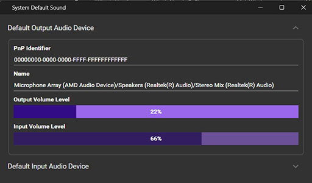

# Sound Windows Scanner (SoundWinScanner)

SoundWinScanner is a sound device scanner engine that contains tools
to detects and outputs plug-and-play audio endpoint devices under Windows.
It handles audio notifications and device changes.

It contains:
- C/C++ sound agent core library SoundAgentLib
- SoundAgentApi DLL, that provides a simple ANSI C API to the library for external clients
- SoundDefaultUI, a lightweight C# UI monitor with SoundAgentApi as backend
- sound-win-scanner, a Go-module that leverages SoundAgentApi for Go-clients
- win-sound-logger, a simple Go (Golang) CLI tool to log audio device information to the console, using SoundAgentApi as backend

## Modules Generated

- **sound-win-scanner**: Go module that wraps the C++ core logic and provides a Go API for [WinSoundScanner](https://github.com/collect-sound-devices/win-sound-scanner-go)

## Executables Generated

- **SoundDefaultUI**: Lightweight WPF UI showing the live volume levels of the default audio devices, output and input device separately.
  
- **SoundAgentCli**: Command-line test CLI.
- **win-sound-logger.exe**: Simple Go test CLI that logs the current default audio devices and later device/volume change events to the console.

## Technologies Used

- **C++ / Go (Golang)**: Core logic implementation.
- **C# / WPF**: Lightweight UI for displaying live volume levels of the currently default audio devices.

## Install and Run:

### `SoundDefaultUI.exe`
- Download and unzip the latest rollout of **SoundDefaultUI-x.x.x**. from the latest repository
release's assets, [Release](https://github.com/collect-sound-devices/sound-win-scanner/releases/latest)

- Install certificates and unblock the `SoundDefaultUI.exe` per PowerShell (start as Administrator):
    ```powershell
    Import-Certificate -FilePath .\CodeSign.cer -CertStoreLocation Cert:\LocalMachine\Root
    Unblock-File -Path .\SoundDefaultUI.exe
    ```
### 'SoundAgentCli.exe'

- Download and unzip the latest rollout of **SoundAgentCli-x.x.x**. from the latest repository
  release's assets, [Release](https://github.com/collect-sound-devices/sound-win-scanner/releases/latest)

### 'win-sound-logger'

- Download and unzip the latest rollout of **win-sound-logger-x.x.x**. from the latest repository
  release's assets, [Release](https://github.com/collect-sound-devices/sound-win-scanner/releases/latest)


## Developer Environment, How to Build:

### Prerequisites

- Visual Studio 2026 (or later) with C++ and .NET toolchain installed.
- .NET 10 SDK installed (required to build the WPF `SoundDefaultUI` project).
- Go SDK installed (required to build `win-sound-logger`).
- vcpkg installed and bootstrapped:
  - Clone vcpkg and run the bootstrap script (Windows): `bootstrap-vcpkg.bat`
  - Ensure `vcpkg.exe` is available on PATH or configure your build to point to it.
    
### Building

```powershell
&"c:\Program Files\Microsoft Visual Studio\2022\Community\Msbuild\Current\Bin\MSBuild.exe" SoundWinScanner.sln /target:Rebuild -restore /p:Configuration=Release /p:RestorePackagesConfig=true

.\scripts\buildGo.ps1 
```
The resulting binaries:
- `Projects\SoundDefaultUI\bin\Release\net10.0-windows10*\SoundDefaultUI.exe`
- `Projects\SoundAgentCli\bin\x64\Release\SoundAgentCli.exe`
- `x64\Release\win-sound-logger.exe`

## License

This project is licensed under the terms of the [MIT License](LICENSE).

## Contact

Eduard Danziger

Email: [edanziger@gmx.de](mailto:edanziger@gmx.de)
