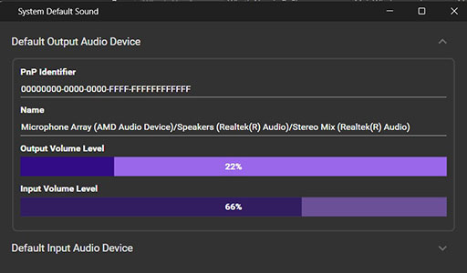

# Sound Windows Scanner

Sound Scanner detects and outputs plug-and-play audio endpoint devices under Windows. It handles audio notifications and device changes.

## Executables Generated

- **SoundDefaultUI**: Lightweight WPF UI showing the live volume levels of the default audio devices, output and input device separately.
  
- **SoundAgentCli**: Command-line test CLI.

## Technologies Used

- **C++ / Go**: Core logic implementation.
- **RabbitMQ**: Used as a message broker for reliable audio device information delivery.
- **C# / WPF**: Lightweight UI for displaying live volume levels of the currently default audio devices.

## Usage

### Usage of RabbitMQ To REST API Forwarder in SoundWinScanner

1. Install RabbitMQ via chocolatey. If didn't install chocolatey yet, please follow [Chocolatey](https://chocolatey.org/install)

```powershell
# Install RabbitMQ via chocolatey (elevated, as admin)
choco install rabbitmq
```

2. Download and unzip the latest rollout of RambbitMQ-To REST-API-Forwarder: RmqToRestApiForwarder-x.x.x. from
the latest release's assets, [RmqToRestApiForwarder Release](https://github.com/eduarddanziger/rmq-to-rest-api-forwarder/releases/latest)
3. Register RmqToRestApiForwarder.exe as a Windows Service and start it:

```powershell
# Register (elevated, as admin) and start the RMQ-To-RESTAPI-Forwarder Windows Service
sc create RmqToRestApiForwarder binPath="<your folder>\RmqToRestApiForwarder.exe" start=auto
sc start RmqToRestApiForwarder
```

### SoundDefaultUI
1. Download and unzip the latest rollout of SoundDefaultUI-x.x.x. from the latest repository
release's assets, [Release](https://github.com/eduarddanziger/SoundWinScanner/releases/latest)

2. Install certificates and unblock the SoundDefaultUI.exe per PowerShell (start as Administrator):

```powershell
   Import-Certificate -FilePath .\CodeSign.cer -CertStoreLocation Cert:\LocalMachine\Root
   Unblock-File -Path .\SoundDefaultUI.exe
```
3. Run the SoundDefaultUI

## Developer Environment, How to Build:

1. Install Visual Studio 2022
2. Build the solution, e.g. if you use Visual Studio Community Edition:
```powershell
%NuGet% restore SoundWinScanner.sln
"c:\Program Files\Microsoft Visual Studio\2022\Community\Msbuild\Current\Bin\MSBuild.exe" SoundWinScanner.sln /p:Configuration=Release /target:Rebuild -restore
```

## License

This project is licensed under the terms of the [MIT License](LICENSE).

## Contact

Eduard Danziger

Email: [edanziger@gmx.de](mailto:edanziger@gmx.de)
